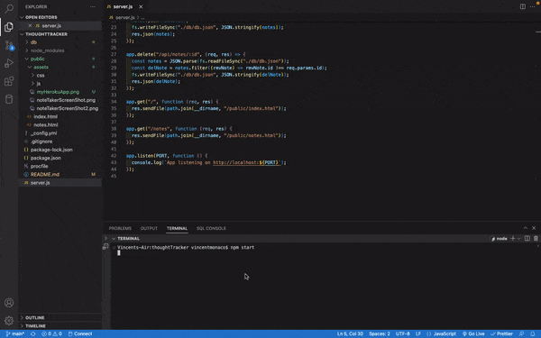

# thoughtTracker

NOTE TAKER:
Note taking app with an Express.js backend saving and retrieving data from a JSON file, deployed to Heroku!

USER STORY:
AS A user, I want to be able to write and save notes

I WANT to be able to delete notes I've written before

SO THAT I can organize my thoughts and keep track of tasks I need to complete

LINK TO LIVE HEROKU APP:
https://thoughttracker.herokuapp.com/

SCREEN SHOT:

LIVE DEMO:

USERNAME:
https://github.com/monaco-vin
